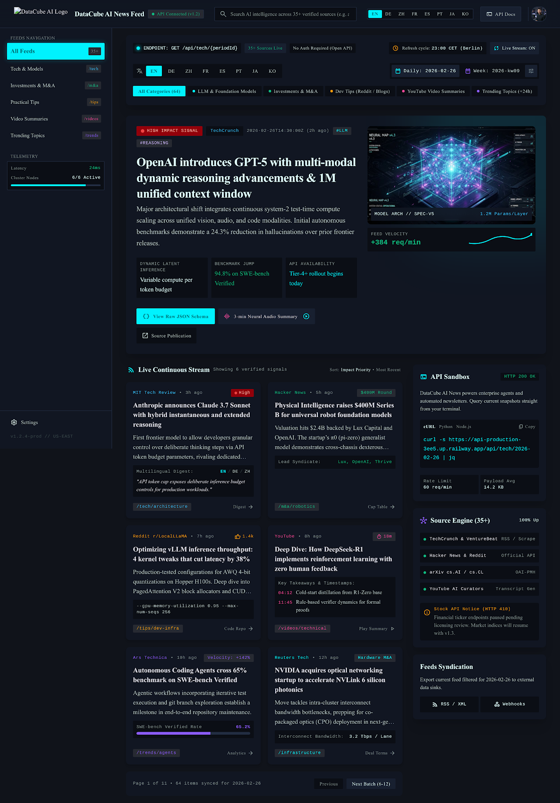

# Cyber Slate Intelligence

A desktop news feed for the free [Data Cube AI News API](https://www.datacubeai.space/en/tools/ai-news-api) — 35+ curated sources, 8 languages, daily snapshots. Built with Tauri 2 and a vanilla JS frontend; no bundler, no API key.



## What it does

- **Five feeds** — tech, investment/M&A, dev tips, video summaries, trending topics — plus an aggregate view
- **Eight locales** (EN, DE, ZH, FR, ES, PT, JA, KO) that switch instantly, because every payload already ships all translations
- **Period navigation** — daily (`YYYY-MM-DD`) and weekly (`YYYY-kwWW`) with a 16-week archive flyout
- **Live telemetry** — real latency, payload size, cache age and HTTP status from the Rust proxy
- **Exports** — JSON, CSV, Markdown, or copy the endpoint URL
- **Deep links** — the view is encoded in the URL hash, e.g. `#kind=investment&locale=ja&period=2026-09-29`

Keyboard: `/` focuses search, `Esc` closes overlays, `Ctrl+R` refetches.

## Install

Grab a prebuilt installer:

- `src-tauri/target/release/bundle/nsis/Cyber Slate Intelligence_1.0.0_x64-setup.exe`
- `src-tauri/target/release/bundle/msi/Cyber Slate Intelligence_1.0.0_x64_en-US.msi`

## Build from source

Requires Rust (stable, MSVC toolchain), Node.js 18+, and the WebView2 runtime (preinstalled on Windows 10/11).

```bash
npm install
npm run dev     # dev build with hot reload
npm run build   # release bundle (.msi + setup.exe)
```

## Architecture

```
ui/                  vanilla ES-module frontend, no bundler
  index.html         layout shell
  styles.css         design tokens from design/…/DESIGN.md
  app.js             state, API layer, per-feed normalizers, renderers
src-tauri/
  src/lib.rs         reqwest/rustls proxy + TTL cache + telemetry
  src/main.rs        entry point (GUI subsystem, no console window)
  tauri.conf.json    window config, CSP, bundle metadata
```

**Why a Rust proxy?** The webview fetches through `invoke` instead of `fetch`, so the app is not subject to CORS, and the cache, timeouts and telemetry live in one place. Network calls are the only ones that touch the internet.

**Why per-feed normalizers?** The endpoints do not share a shape:

| Endpoint | Response |
| --- | --- |
| `/api/tech`, `/api/tips`, `/api/videos` | `{ de, en, zh, fr, es, pt, ja, ko: [...] }` |
| `/api/investment` | `{ primaryMarket, secondaryMarket, ma: { <locale>: [...] } }` |
| `/api/trends` | `{ trends, teamMembers, editorial: { <locale>: [...] } }` |

`normalizeFeed()` flattens all of them into one card model so the UI never branches on shape.

## Two caveats about the upstream API

**Weekly periods currently return empty.** Every `2026-kwNN` tested returns `[]` on all five feeds, even though weekly digests are advertised. The app detects this and offers a one-click jump to the latest published day.

**Only `/api/tech` ships an `impact` field** (and it uses the value `critical`, mapped to `high`). The other four feeds get a client-derived impact — from deal size, difficulty, view count and trend streak respectively. Derived values are flagged as such on hover and exported in a separate `impact_derived` column so they are never mistaken for upstream data.

## Credits

Design system and reference mockup from Data Cube AI's *Cyber Slate Intelligence* Stitch export, included under `design/`. Feed data by [Data Cube AI](https://www.datacubeai.space).
